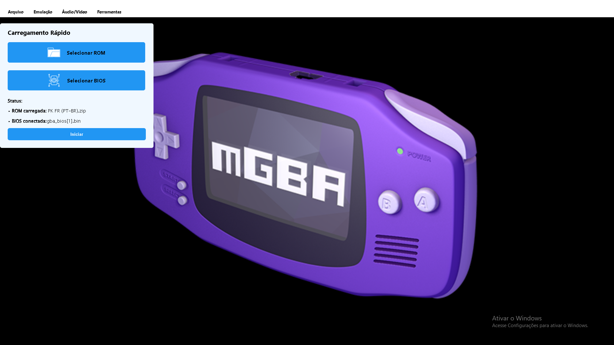

# Painel Carregamento Rápido — mGBA

## 1. Aplicativo Escolhido

**mGBA** — Emulador de Game Boy Advance para PC.  
O mGBA é conhecido como uma das principais escolhas para jogar/emular GBA no computador.

---

## 2. Melhoria

Atualmente, o processo para iniciar uma ROM com BIOS no mGBA envolve diversas etapas:

- Navegar até **Arquivo → Abrir ROM…**
- Em seguida, acessar **Ferramentas → Configurações → BIOS → Configurar BIOS por console**
- Navegar entre diversas abas até encontrar a opção correta

Esse fluxo não é intuitivo e nem um pouco simples, trazendo dificulades a novos usuários e desistencia de uso do emulador.

### Proposta de Nova Funcionalidade

Criação de um **Painel Lateral**, chamado **Carregamento Rápido”**, que permite:

- Selecionar e carregar uma ROM rapidamente
- Conectar automaticamente um arquivo de BIOS do GBA
- Visualizar o status de carregamento e erros

---

## 3. Tela da Nova Funcionalidade

### Localização  
Painel fixo na **lateral esquerda da janela principal**, complementando a área vazia.

---

## Imagem da Interface

### 
